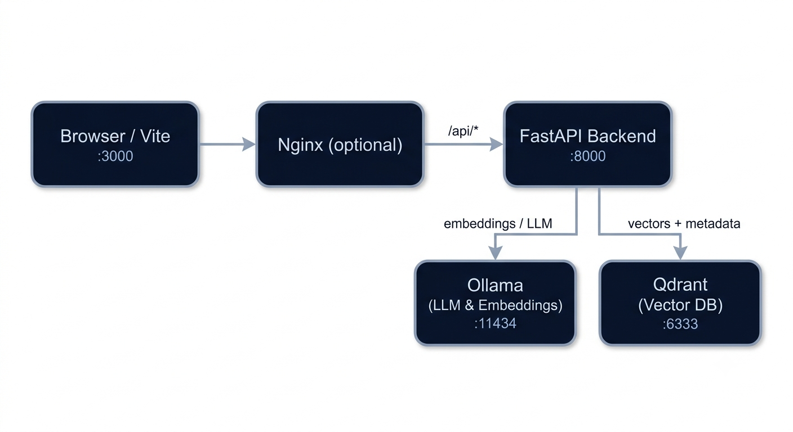

# DESIGN.md

# Design

## Overview

This application implements a Retrieval-Augmented Generation (RAG) workflow over Wikipedia articles.

When a user submits a Wikipedia URL, the backend scrapes the article, splits it into overlapping chunks, generates embeddings, and stores them in Qdrant. When a question is asked, the system retrieves the most relevant chunks and uses a local Ollama-hosted model to generate an answer grounded in the retrieved content.

## Architecture

### Components

**Frontend (React + Vite)**
Provides a simple interface for article ingestion, summary display, and question answering.

**FastAPI Backend**
Coordinates scraping, chunking, embedding generation, retrieval, and LLM interactions.

**Ollama**
Used for both summarization and question answering. Embeddings are generated locally through the configured embedding model.

**Qdrant**
Stores article chunk embeddings and metadata and performs similarity search during retrieval.

## Data Flow

### Ingestion

1. User submits a Wikipedia URL.
2. The article is scraped and cleaned.
3. Content is split into overlapping chunks (1000 characters, 200 overlap).
4. Embeddings are generated and cached.
5. Chunks and metadata are stored in Qdrant.
6. A summary is generated and returned to the frontend.

### Question Answering

1. User submits a question.
2. The question is embedded.
3. Qdrant retrieves the most relevant chunks.
4. Retrieved chunks are combined into a context window.
5. The context and question are sent to the local LLM.
6. The generated answer is returned together with the retrieved evidence.

## Design Decisions

**Qdrant** was selected because it provides persistent vector storage, metadata filtering, and simple Docker deployment.

**Character-based chunking** was chosen for deterministic behaviour and implementation simplicity. While token-aware chunking could improve retrieval quality, it was considered outside the scope of this exercise.

**Embedding caching** was added to reduce repeated inference during development and repeated ingestion of identical content.

**Duplicate detection** is implemented using the article URL to prevent unnecessary reprocessing and vector duplication.

**LLM interactions** are isolated in a dedicated module, allowing the underlying model to be replaced without affecting application logic.

## Testing

Unit tests mock external dependencies such as Ollama and Qdrant, while an optional integration test exercises the fully connected stack. The project achieves more than 85% test coverage and includes a generated coverage report.

## Future Improvements

Potential improvements include hybrid search (BM25 + vector retrieval), token-aware chunking, streaming responses, citation highlighting, and support for multiple ingested articles.
