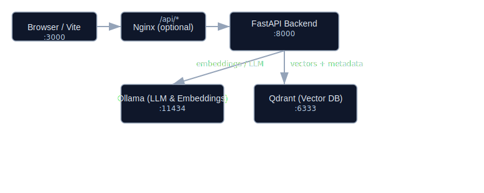

# Design

## Architecture

```text
Browser :3000
    │  /api/*
    ▼
Nginx frontend ─────► FastAPI backend :8000
                          │         │
                 embeddings/chat   │ vectors + payload
                          ▼         ▼
                    Ollama :11434  Qdrant :6333
```

All four components are Compose services. Nginx proxies `/api` so the containerised UI is same-origin; FastAPI also allows the local Vite origins for bare-metal development.

## Ingestion flow

```text
URL validation → Wikipedia fetch → paragraph extraction → overlapping chunks
                                                     ├→ Ollama summary
                                                     └→ Ollama embeddings
                                                        # Design

                                                        ## Architecture

                                                        Browser (:3000) → Nginx frontend → FastAPI backend (:8000)

                                                        Flow (network):

                                                        - Browser (Vite dev server or static UI) talks to Nginx which proxies `/api` to the FastAPI backend.
                                                        - FastAPI calls two runtime services:
                                                          - Ollama (local LLM + embedding endpoint) on port 11434
                                                          - Qdrant (vector database) on port 6333

                                                        Simple ASCII diagram:

                                                            Browser:3000
                                                                │  /api/*
                                                                ▼
                                                            Nginx frontend ──► FastAPI backend:8000
                                                                                │           │
                                                                                │           └─► Qdrant:6333 (vector store)
                                                                                └─► Ollama:11434 (embeddings & LLM)

                                                        All components are started via `docker compose` for local integration. Nginx is optional for local dev (Vite can call the API directly during development).

                                                        
                                                        

                                                        ## Ingestion flow

                                                        1. Client POSTs `{ "url": "https://..." }` to `POST /ingest`.
                                                        2. `scraper.extract_wikipedia_article(url)` validates and fetches the article, returning `{title, content, sections, references}` or `{error}`.
                                                        3. `chunker.chunk_text(content)` splits the article into deterministic, overlapping chunks (default chunk size 1000 chars, overlap 200).
                                                        4. For each chunk:
                                                           - `llm.summarize_article(chunk)` may create a short summary (optional).
                                                           - `embedder.generate_embedding(chunk)` requests an embedding from Ollama (or a mock in tests).
                                                           - `vector_store.store_chunks(...)` upserts vectors and payloads into Qdrant. Payload includes `text`, `title`, `chunk_number`, and `url`.
                                                        5. Duplicate detection: before ingest, `vector_store.article_exists(url)` checks for an existing article (by URL/title) and returns `exists` if found.

                                                        Chunk IDs are deterministic (UUIDv5 derived from URL + chunk number) so repeated ingests don't create duplicate points.

                                                        ## Question / RAG flow

                                                        1. Client calls `GET /ask?question=...&top_k=5` (top_k bounded to 1–10).
                                                        2. Backend calls `embedder.generate_embedding(question)` to obtain a query vector.
                                                        3. `vector_store.search_chunks(vector, limit=top_k)` returns top-k results (score + payload).
                                                        4. If retrieval is empty the API returns 404 (no indexed evidence).
                                                        5. Backend assembles a prompt combining the retrieved chunks as grounding context and calls `llm.answer_question(question, context)`.
                                                        6. Response includes `answer`, `context` (returned chunks), and timing diagnostics (`t_embedding`, `t_search`, `t_generation`, `t_total`) when enabled.

                                                        ## Technology choices and trade-offs

                                                        - FastAPI: quick to develop, typed validation, easy to mock for unit tests.
                                                        - React + Vite: minimal frontend boilerplate and fast HMR during development.
                                                        - Ollama (`qwen2.5:3b`): chosen for local inference and embedding endpoint. Useful for demos but the image is large; unit tests mock it.
                                                        - `nomic-embed-text` or Ollama embedding endpoint: local embeddings avoid data egress.
                                                        - Qdrant: durable vector store with metadata filtering and an easy Docker image for local testing.
                                                        - Chunking: character-based chunks (1000 chars, 200 overlap) are deterministic and simple; token-aware chunking would be better but adds complexity.

                                                        ## Module contracts

                                                        - `scraper.extract_wikipedia_article(url) -> dict | {error}`
                                                        - `chunker.chunk_text(text, chunk_size=1000, overlap=200) -> list[str]`
                                                        - `embedder.generate_embedding(text) -> list[float]` (sync), `generate_embeddings_async(texts) -> list[list[float]]`
                                                        - `vector_store.store_chunks(points)` and `vector_store.search_chunks(vector, limit) -> list[payload]`
                                                        - `llm.summarize_article(text) -> str` and `llm.answer_question(question, context) -> str`

                                                        Configuration (ports, model names, endpoints) is environment-driven so Ollama/Qdrant can be swapped or mocked for tests.

                                                        ## Testing strategy

                                                        - Unit tests: mock HTTP calls and the `vector_store.client` to test logic without external services. Mocks ensure unit tests are fast and deterministic.
                                                        - API tests: use FastAPI `TestClient` and monkeypatch internal service functions to exercise request/response wiring.
                                                        - Integration test: gated with `RUN_INTEGRATION=1` — runs against the real Docker Compose stack (Ollama + Qdrant) and exercises the end-to-end flow.
                                                        - Coverage: aim for >=85% line coverage on application code. Tests should be meaningful (exercise branches and error paths). The integration test is optional for graders and skipped by default.

                                                        ## Failure behavior

                                                        - Invalid or non-Wikipedia URLs: `POST /ingest` returns 400 with an error message.
                                                        - Empty content after chunking: `POST /ingest` returns 400.
                                                        - No retrieved context for a question: `GET /ask` returns 404 (avoids hallucinated answers).
                                                        - External service errors surface as 5xx and are visible in container logs for debugging.

                                                        ## Simple ASCII diagram (alternative view)

                                                            [Browser]
                                                               │
                                                            [Nginx]──/api──►[FastAPI]
                                                                              ├──►[Ollama (embeddings/LLM)]
                                                                              └──►[Qdrant (vector DB)]

                                                        ---

                                                        If you want, I can also add a small PNG diagram and commit it next to this file. Would you like a PNG diagram added, or is this cleaned Markdown sufficient? 
